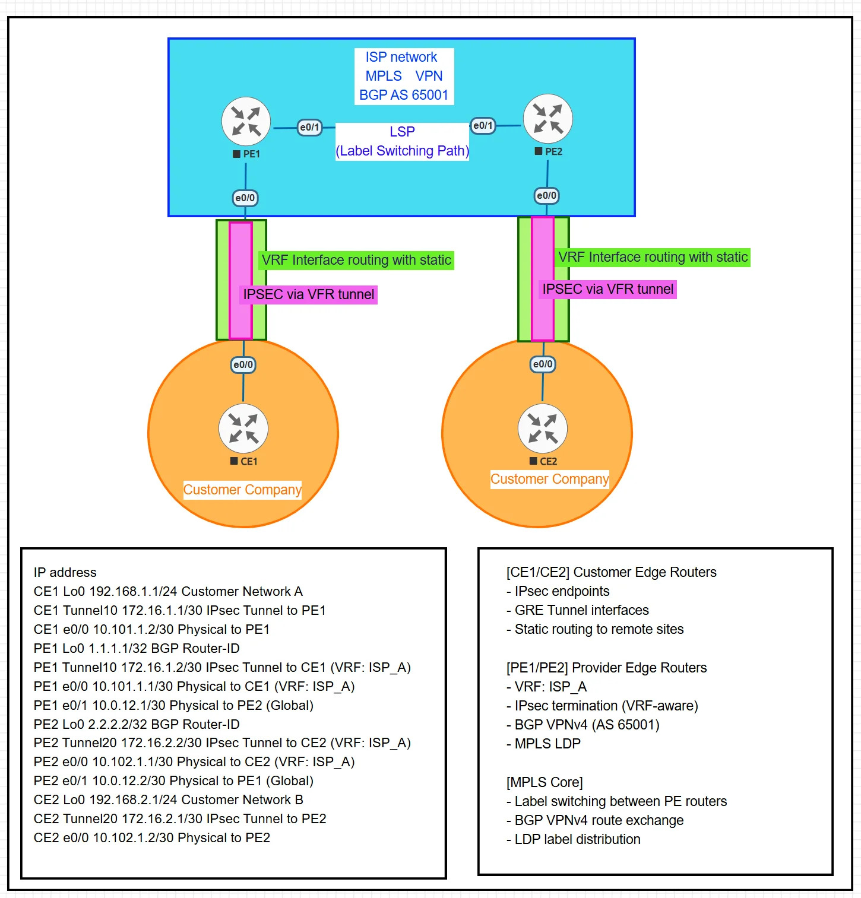

# IPsec over MPLS VPN with VRF



## Summary

Site-to-site VPN over ISP MPLS backbone with VRF-aware IPsec at PE-CE boundaries. PE routers exchange routes via BGP VPNv4 while MPLS provides label switching in the provider core.

## Configs

- [CE1.cfg](CE1.cfg) - Customer Edge (Site A)
- [PE1.cfg](PE1.cfg) - Provider Edge 1 (VRF + IPsec + BGP + MPLS)
- [PE2.cfg](PE2.cfg) - Provider Edge 2 (VRF + IPsec + BGP + MPLS)
- [CE2.cfg](CE2.cfg) - Customer Edge (Site B)

## Verification

```
show crypto isakmp sa
show ip route vrf ISP_A
show bgp vpnv4 unicast vrf ISP_A
ping vrf ISP_A 192.168.2.1 source 192.168.1.1
```

**Blog:** [Medium Article](link)
